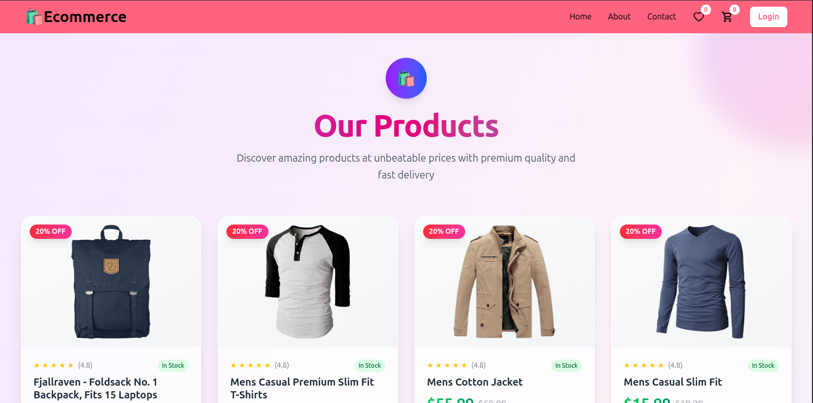

<!-- Project Banner -->
<p align="center">
  
</p>

# 🛍️ Ecommerce Web Application

A fully responsive ecommerce platform with user authentication, cart management, order placement, and order history. Built using modern web technologies and Firebase as the backend.

---

## 🔑 Features

- 🔒 **User Authentication** (Sign up, Login, Logout)
- 🛒 **Add/Remove Items** to/from the Cart
- 📦 **Place Orders**
- 🕒 **View Order History**
- 📱 **Responsive Design** for Mobile and Desktop

---

## 💻 Technologies Used

- ⚛️ **React** – Front-end library
- 🚦 **React Router** – Page routing/navigation
- 🛠️ **Context API** – For global state management
- 🌐 **Axios** – For API requests
- 💅 **Styled-components** – For component-level styling
- 🔥 **Firebase** – Backend & Authentication

---

## 📸 Screenshot

> 

---

## 🚀 Getting Started

### 1. Clone the repository
```bash
git clone https://github.com/your-username/ecommerce-app.git
cd ecommerce-app
